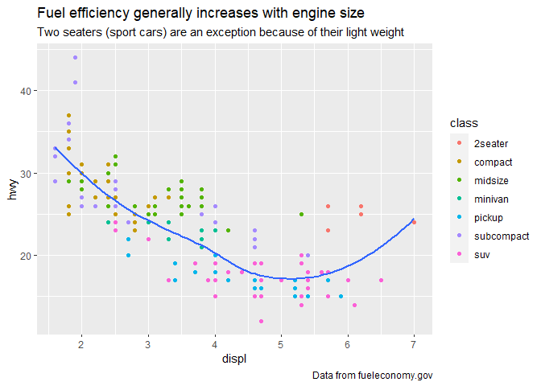

cap 22
================
pedro
19/11/2020

### Rótulo

``` r
ggplot(mpg, aes(displ, hwy)) +
  geom_point(aes(color = class)) +
  geom_smooth(se = FALSE) +
  labs(
    title = paste(
      "Fuel efficiency generally increases with",
      "engine size"
    )
  )
```

    ## `geom_smooth()` using method = 'loess' and formula 'y ~ x'

<!-- -->

### mais informações adicionadas

``` r
ggplot(mpg, aes(displ, hwy)) +
  geom_point(aes(color = class)) +
  geom_smooth(se = FALSE) +
  labs(
    title = paste(
      "Fuel efficiency generally increases with",
      "engine size"
    ),
    subtitle = paste(
      "Two seaters (sport cars) are an exception",
      "because of their light weight"
    ),
    caption = paste(
      "Data from fueleconomy.gov"
    )
  )
```

    ## `geom_smooth()` using method = 'loess' and formula 'y ~ x'

<!-- -->

### mudando os títulos dos eixos

``` r
ggplot(mpg, aes(displ, hwy)) +
  geom_point(aes(color = class)) +
  geom_smooth(se = FALSE) +
  labs(
    x = "Engine displacement (L)",
    y = "Highway fuel economy (mpg)",
    colour = "Car type"
  )
```

    ## `geom_smooth()` using method = 'loess' and formula 'y ~ x'

<!-- -->

### usando equações matemáticas em vez de strings de texto

``` r
df <- tibble(
  x = runif(10),
  y = runif(10)
)
ggplot(df, aes(x, y)) +
  geom_point() +
  labs(
    x = quote(sum(x[i] ^ 2, i == 1, n)),
    y = quote(alpha + beta + frac(delta, theta))
  )
```

<!-- -->
